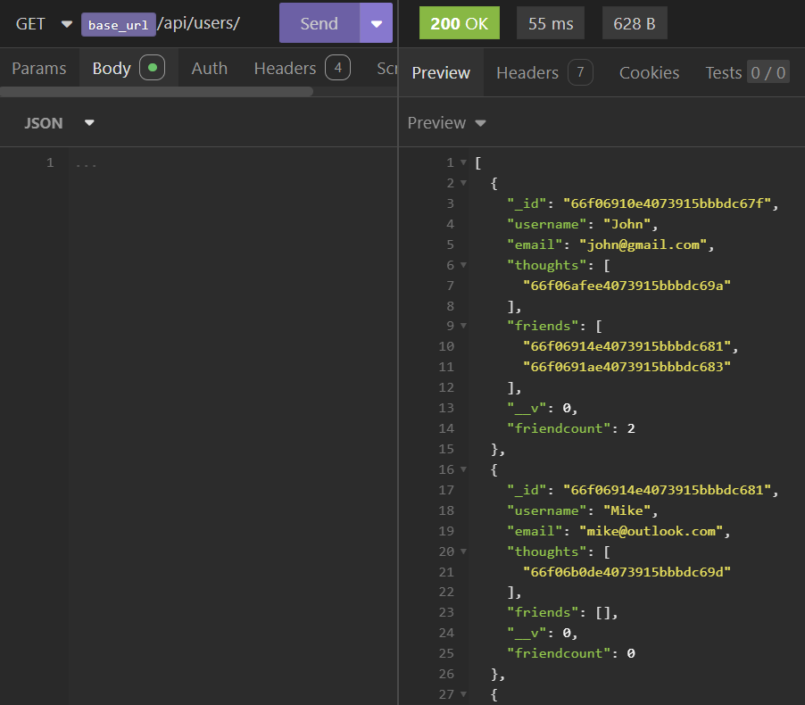

# NoSQL: Social Network API

## Summary
In this challenge, we'll build a set of APIs for a social network web application where users can share their thoughts, react to friends’ thoughts, and create a friend list. This application will use Express.js for routing, MongoDB as its database, and Mongoose ODM for creating and managing the schemas that serve as the basis for the social network. The application will also use a JavaScript 'Date' object to format timestamps in an easy to read format.

## Technologies
The following is the list of technologies used to implement this application:
1. Express.js for building and supporting the API routes and handling the APIs request and responses

2. MongoDB as a NoSQL and object-oriented database for building and persisting the social network data models 

3. Mongoose as an Object Data Modeling (ODM) library for creating the schemas that define the structure of the application's data models

4. Moment.js library for formatting timestamps in a user friendly manner 

5. REST endpoints that serve as the implementation of the social network API routes

## Application Execution
This application does not include a frontend and therefore will not be deployed.  Instead, all API functionality supporting the creation of a social network will have to be invoked and tested using a tool such as Insomnia.

The implemented routes will be tested for CRUD operations for creating, reading, updating and deleting the (users), (thoughts) and (friends of users) that serve as the data models supporting the social network.

A walkthrough video demonstrating the functionality of the application (e.g. execution of APIs using the tool Insomnia) will be provided at the end of this README.

## Bonus Feature
The following bonus feature has also been implemented:
* When a user's is deleted, the thoughts associated with that user are also deleted

## Application Architecture
The following is the outline of the application architecture, including the data models and routes for implementing the API functionality.

### Models
There are three schemas that define the structure of the application's data models.  The following is a high level overview of the models and their schema options:

### User
* username: A string that is required, unique, and trimmed (whitespace is to be removed from both ends)
* email: A string that is required, unique, and must match a regular expression pattern for a valid email address
* thoughts: An array of ObjectId references to the Thought model
* friends: An array of ObjectId references to the User model (self-reference)

**Schema Settings**:
A virtual called `friendCount` that retrieves the length of the user's `friends` array field on query

### Thought
* thoughtText: A string field that represents the user's thought
* createdAt: A date field that represents the date and time the thought was created. It uses a getter to format the date when queried
* username: A string field that represents the user that created the thought
* reactions: An array of nested reactionSchema objects

**Schema Settings**:
A virtual called `reactionCount` that returns the number of reactions for a thought.

### Reaction (SCHEMA ONLY)
* reactionId: Unique identifier for the reaction.
* reactionBody: A string field that represents a user's reaction to a thought
* username: A string field that represents the user that created the reaction
* createdAt: A date field that represents the date and time the reaction was created. It uses a getter to format the date when queried

**Schema Settings**:
This schema will not be instantiated as a model, but rather will be used as the `reaction` field's subdocument schema in the `Thought` model.

### API Routes
The following table outlines the routes, the controller functions that implement the endpoint and a description of the intended functionality.

**Note:" The table below is a "by-glance" summary of the routes. For the definition of element types, the request/response details and endpoint parameters, refer to the aforementioned User.js, Thought.js and Reaction.js schemas in the models folder, and userController.js and thoughtController.js in the controllers folder, respectively.

| method | route                                          | route handler        | request body          | Purpose                                     |
| :----- | :--------------------------------------------- | :------------------- | :-------------------- | :------------------------------------------ |
| POST   | /api/users                                     | createUser           | userName, email       | Creates a user                              |
|  
| PUT    | /api/users/:userId                             | updateUser           | userName, email       | Updates the name and/or email of a user     |
|  
| GET    | /api/users/                                    | getUsers             | none                  | returns the list of all users               |
|  
| GET    | /api/users/:userId                             | getSingleUser        | none                  | returns the user by userId                  |
|  
| DELETE | /api/users/:userId                             | removeUser           | none                  | deletes the user by userId                  |
|  
| POST   | /api/users/:userId/friends/:friendId           | addFriend            | none                  | adds a friend to user by respective userIds |
|  
| DELETE | /api/users/:userId/friends/:friendId           | removeFriend         | none                  | removes user's friend by respective userIds |
|  
| POST   | /api/thoughts                                  | createThought        | thoughtText, username | creates a thought for a user                |
|  
| PUT    | /api/thoughts/:thoughtId                       | updateThought        | thoughtText, username | updates a user's thought                    |
|  
| GET    | /api/thoughts                                  | getThoughts          | none                  | gets all thoughts created by users          |
|  
| GET    | /api/thoughts/:thoughtId                       | getSingleThought     | none                  | gets a single thought by thoughtId          |
|  
| DELETE | /api/thoughts/:thoughtId                       | removeThought        | none                  | removes a single thought by thoughtId       |
|  
| POST   | /api/thoughts/:thoughtId/reactions             | addReaction          | reactionBody, username| add reaction a thought by thoughtId         |
|  
| DELETE | /api/thoughts/:thoughtId/reactions/:reactionId | removeReaction       | none                  | removes a reaction by thoughtId & reactionId |

## Future Enhancements
This application in its current form is simply a backend implementation that is intended to demonstrate the use of relevant technologies such as MongoDB, Express and REST APIS to build a Social Network platform. What is obviously missing is a frontend application that can build upon the REST APIs to create a fully functioning social network application.  

The following is an outline of upcoming features that are currently in the planning phase:

1. Frontend application
A frontend application utilizing the suite of the provided APIS, particularly one with an easy to use UI, should be considered.

2. User Authentication
Given that the APIs provide a means of adding and removing a friend from a user's array of friends, an improved level of privacy and security should be considered to safeguard such personal and sensitive information.

Session-based authentication and JWT (JSON Web Token) approaches are popular methods for implementing user authentication, thought they have their key differences.  Once an approach is decided upon, support mechanisms, which may included implementations on both frontend and backend, should be considered.

## Executing the Application Locally
To run the application locally, perform the following
* Clone the project from: https://github.com/reztndev/RezTech-Social-Network-API
* Open the project in Visual Studio Code
* Open a terminal and run the following:
1. npm install
2. npm run dev

Executing the above commands, starts the server on port 3001.  

## Testing the Routes
Once the server is running, you may use a tool such as Insomnia to exercise and test the APIs. You may refer to the test guides in (assets/insomnia-test-guide) to formulate a plan for creating the appropriate API collection in Insomnia.

## Link to the walkthrough video
Use this link to view the recorded video demonstrating the execution of APIs that have been implemented to support this social network application: https://youtu.be/jmbaqQHe_E8

## Sample Screenshots of API Execution on Insomnia
The following screenshots demonstrate the execution of some key endpoints, including the request/response and/or relevant route parameters, on Insomnia:

